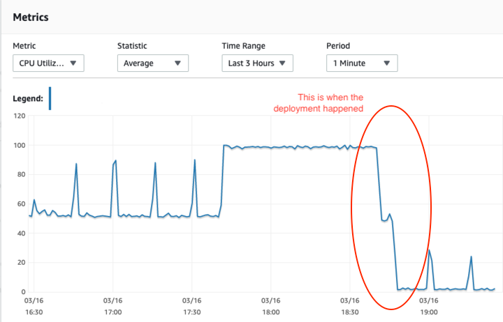

[](https://github.com/kirschbaum-development/eloquent-power-joins/actions)
[](LICENSE.md)
[](https://packagist.org/packages/kirschbaum-development/eloquent-power-joins)
[](https://packagist.org/packages/kirschbaum-development/eloquent-power-joins)
[](https://github.styleci.io/repos/247844867)
[](https://scrutinizer-ci.com/g/kirschbaum-development/eloquent-power-joins/?branch=master)

The Laravel magic you know, now applied to joins.

Joins are very useful in a lot of ways. If you are here, you most likely know about and use them. Eloquent is very powerful, but it lacks a bit of the "Laravel way" when using joins. This package make your joins in a more Laravel way, with more readable with less code while hiding implementation details from places they don't need to be exposed.

A few things we consider is missing when using joins which are very powerful Eloquent features:

* Ability to use relationship definitions to make joins;
* Ability to use model scopes inside different contexts;
* Ability to query relationship existence using joins instead of where exists;
* Ability to easily sort results based on columns or aggregations from related tables;

## Installation

You can install the package via composer:

```bash
composer require kirschbaum-development/eloquent-power-joins
```

And that's it, you are ready to use the package.

## Usage

This package provides a few features.

### 1 - Join Relationship

Let's say you have a `User` model with a `hasMany` relationship to the `Post` model. If you want to join the tables, you would usually write something like:

```php
User::select('users.*')->join('posts', 'posts.user_id', '=', 'users.id');
```

This package provides you with a new `joinRelationship()` method, which does the exact same thing.

```php
User::joinRelationship('posts');
```

Both options produce the same results. In terms of code, you didn't save THAT much, but you are now using the relationship between the `User` and the `Post` models to join the tables. This means that you are now hiding how this relationship works behind the scenes (implementation details). You also don't need to change the code if the relationship type changes. You now have more readable and less overwhelming code.

But, **it gets better** when you need to **join nested relationships**. Let's assume you also have a `hasMany` relationship between the `Post` and `Comment` models and you need to join these tables.

```php
User::select('users.*')
    ->join('posts', 'posts.user_id', '=', 'users.id')
    ->join('comments', 'comments.post_id', '=', 'posts.id');
```

Instead of writing all this, you can simply write:

```php
User::joinRelationship('posts.comments');
```

So much better, wouldn't you agree?! You can also `left` or `right` join the relationships as needed.

```php
User::leftJoinRelationship('posts.comments');
User::rightJoinRelationship('posts.comments');
```

**Joining polymorphic relationships**

Let's imagine, you have a `Image` model that is a polymorphic relationship (`Post -> morphMany -> Image`). Besides the regular join, you also need to apply the `where imageable_type = Image::class` condition, otherwise you could get messy results.

Turns out, if you join a polymorphic relationship, Eloquent Power Joins automatically applies this condition for you. You simply need to call the same method.

```php
Post::select('posts.*')->joinRelationship('images');
```

**Applying conditions & callbacks to the joins**

Now, let's say you want to apply a condition to the join you are making. You simply need to pass a callback as the second parameter to the `joinRelationship` method.

```php
User::select('users.*')->joinRelationship('posts', function ($join) {
    $join->where('posts.approved', true);
})->toSql();
```

For nested calls and for `BelongsToMany` relationships (where two tables are joined), you simply need to pass an array referencing the relationship names.

```php
User::select('users.*')->joinRelationship('posts.comments', [
    'posts' => function ($join) {
        $join->where('posts.published', true);
    },
    'comments' => function ($join) {
        $join->where('comments.approved', true);
    }
]);
```

**Using model scopes inside the callbacks 🤯**

We consider this one of the most useful features of this package. Let's say, you have a `published` scope on your `Post` model:

```php
    public function scopePublished($query)
    {
        $query->where('published', true);
    }
```

When joining relationships, you **can** use the scopes defined in the model being joined. How cool is this?

```php
User::joinRelationship('posts', function ($join) {
    // the $join instance here can access any of the scopes defined in Post 🤯
    $join->published();
});
```

When using model scopes inside a join clause, you **can't** type hint the `$query` parameter in your scope. Also, keep in mind you are inside a join, so you are limited to use only conditions supported by joins.

**Select * from table**

When making joins, using `select * from ...` can be dangerous as fields with the same name between the parent and the joined tables could conflict. Thinking on that, if you call the `joinRelationship` method without previously selecting any specific columns, Eloquent Power Joins will automatically include that for you. For instance, take a look at the following examples:

```php
User::joinRelationship('posts')->toSql();
// select users.* from users inner join posts on posts.user_id = users.id
```

And, if you specify the select statement:

```php
User::select('users.id')->joinRelationship('posts')->toSql();
// select users.id from users inner join posts on posts.user_id = users.id
```

**Soft deletes**

When joining any models which uses the `SoftDeletes` trait, the following condition will be also automatically applied to all your joins:

```sql
and "users"."deleted_at" is null
```

### 2 - Querying relationship existence (Using Joins)

[Querying relationship existence](https://laravel.com/docs/7.x/eloquent-relationships#querying-relationship-existence) is a very powerful and convenient feature of Eloquent. However, it uses the `where exists` syntax which is not always the best and may not be the more performant choice, depending on how many records you have or the structure of your tables.

This packages implements the same functionality, but instead of using the `where exists` syntax, it uses **joins**.

**Performance**

First thing to be aware here, is that the below example is one use-case where using `joins` over `where exists` is a lot more performant. You shouldn't assume this is true out of the box, and you should use tools like [Laravel Debugbar](https://github.com/barryvdh/laravel-debugbar) or [Laravel Telescope](https://laravel.com/docs/7.x/telescope) and figure out what's best for YOUR use-case.

That said, below you can see one example of the MySQL CPU usage after deploying a change to use `hasUsingJoins` instead of `has`, in one of our client's application. MySQL was running on RDS, and this image was took from AWS CloudWatch.



Below, you can see the methods this package implements and also the Laravel equivalent.

**Laravel Native Methods**

``` php
User::has('posts');
User::has('posts.comments');
User::has('posts', '>', 3);
User::whereHas('posts', function ($query) {
    $query->where('posts.published', true);
});
User::doesntHave('posts');
```

**Package equivalent, but using joins**

```php
User::hasUsingJoins('posts');
User::hasUsingJoins('posts.comments');
User::hasUsingJoins('posts.comments', '>', 3);
User::whereHasUsingJoins('posts', function ($query) {
    $query->where('posts.published', true);
});
User::doesntHaveUsingJoins('posts');
```

### 3 - Order by

You can also sort your query results using a column from another table using the `orderByUsingJoins` method.

```php
User::orderByUsingJoins('profile.city');
```

This query will sort the results based on the `city` column on the `user_profiles` table. You can also sort your results by aggregations (`COUNT`, `SUM`, `AVG`, `MIN` or `MAX`).

For instance, to sort users with the highest number of posts, you can do this:

```php
$users = User::orderByCountUsingJoins('posts.id', 'desc')->get();
```

Or, to get the list of posts where the comments contain the highest average of votes.

```php
$posts = Post::orderByAvgUsingJoins('comments.votes', 'desc')->get();
```

And you also have methods for `SUM`, `MIN` and `MAX`:

```php
Post::orderBySumUsingJoins('comments.votes');
Post::orderByMinUsingJoins('comments.votes');
Post::orderByMaxUsingJoins('comments.votes');
```

***

## Contributing

Please see [CONTRIBUTING](CONTRIBUTING.md) for details.

### Security

If you discover any security related issues, please email luis@kirschbaumdevelopment.com or nathan@kirschbaumdevelopment.com instead of using the issue tracker.

## Credits

- [Luis Dalmolin](https://github.com/luisdalmolin)

## Sponsorship

Development of this package is sponsored by Kirschbaum Development Group, a developer driven company focused on problem solving, team building, and community. Learn more [about us](https://kirschbaumdevelopment.com) or [join us](https://careers.kirschbaumdevelopment.com)!

## License

The MIT License (MIT). Please see [License File](LICENSE.md) for more information.

## Laravel Package Boilerplate

This package was generated using the [Laravel Package Boilerplate](https://laravelpackageboilerplate.com).
